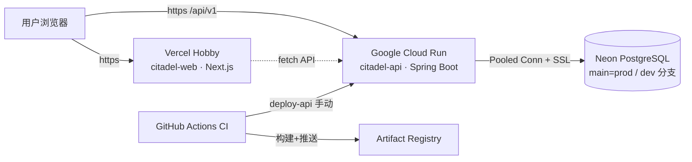
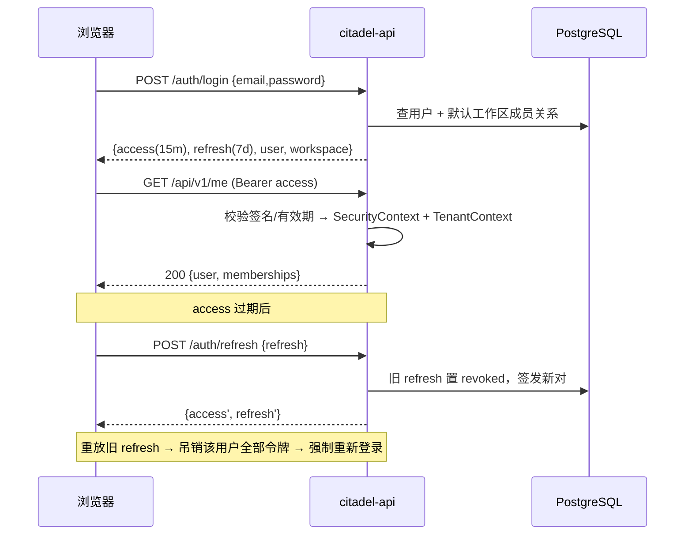

# Citadel 架构说明

## 部署拓扑



- **前端**：Vercel Hobby（免费）。`NEXT_PUBLIC_API_BASE_URL` 构建期内联，指向 Cloud Run 地址。
- **后端**：Cloud Run `us-central1`（常驻免费额度：200 万请求 / 18 万 vCPU 秒 / 月），缩容到 0。
- **数据库**：Neon（Pooled connection 走内置 PgBouncer；`main` 分支 = prod，`dev` 分支 = 本地/冒烟）。
- **镜像**：Artifact Registry `citadel` 仓（免费 0.5GB，保留最近 2 个 tag 即可）。

## 后端分层

```
io.citadel.core
├── controller/   AuthController / MeController / ApiExceptionHandler（异常 → 统一错误体）
├── service/      AuthService（接口）+ impl/AuthServiceImpl（事务边界在这里）
├── repository/   Spring Data JPA
├── entity/       User / Workspace（租户根）/ WorkspaceMember / RefreshToken / AuditEvent
├── dto/          Java record（出入参隔离）
├── security/     JwtService（签发/校验）· JwtAuthenticationFilter · RestAuthenticationEntryPoint
├── audit/        TenantContext · AuditedEvent · 发布器/监听器（append-only）
└── config/       SecurityConfig · CorsProperties 等配置属性
```

关键决策：

| 决策 | 理由 |
|---|---|
| JWT access（15m，HS256）+ 不透明 refresh（7d，SHA-256 哈希落库） | 无状态水平扩展 + 可吊销；刷新令牌一次性轮换，重放即视为泄露（吊销该用户全部令牌） |
| `ddl-auto: validate` + Flyway | schema 唯一事实来源在迁移脚本，启动期校验实体与库一致 |
| 注册即建租户（同事务） | 用户不会处于“无工作区”的孤儿状态；OWNER 角色随租户诞生 |
| 未知邮箱也做等耗时 BCrypt 比对 | 防响应时间枚举探测 |
| 枚举用 varchar + CHECK | 与 Hibernate validate 兼容；如需 PG enum 走 expand-contract 迁移 |

## 多租户地基（F1 的落点）

- access token 携带 `wid`（workspaceId）与 `role`，**租户归属以令牌声明为准**，不信任请求参数；
- `JwtAuthenticationFilter` 将 `wid` 注入 `TenantContext`（ThreadLocal），请求结束清理；
- schema 规范：业务表必含 `workspace_id`，唯一约束以租户为前缀（租户内唯一，全局不唯一）；
- F1 待办：repository 层强制过滤 + 防御性测试（跨租户访问一律 404，防存在性泄露）。

## 认证时序（登录 → 受保护请求 → 刷新）



## 前端结构

```
apps/web/src
├── api/       client.ts（fetch 封装：Bearer 注入、401 单次刷新重放）· auth.ts
├── store/     auth.ts（zustand + localStorage 持久化会话）
├── lib/       env.ts（zod 启动校验）· utils.ts
├── components/ui/  button/input/label/card（shadcn 风格）
└── app/
    ├── (auth)/login · (auth)/register      # 公开路由组
    ├── (app)/dashboard                     # 受保护路由组（布局级守卫）
    └── api/health                          # 容器探针
```

- API 契约集中在 `packages/api-contract`（zod）：表单校验、响应解析、错误码映射三处共用；
- 环境变量缺失在构建/启动期 fail-fast，而不是运行时请求才失败。
