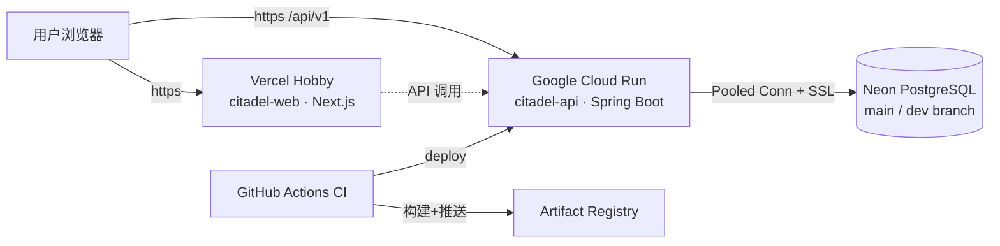

# 作品一 · Citadel — Monorepo 脚手架实施方案（Plan v2）

> 状态：**已执行**（P1–P5 于 2026-10-05 完成，即本仓库；执行结果与偏差记录见文末「执行记录」）。

---

## 1. 产品定位与工程命名

| 项 | 值 |
|---|---|
| 产品定位 | B2B 多租户团队协作平台（看板/工单/看板仪表盘 + 组织治理：租户隔离、RBAC、订阅计费、审计） |
| 产品名 | **Citadel**（堡垒） |
| Monorepo 仓库名 / 本地目录 | **`citadel-core`**（`-core` 为业界常见的平台核心仓后缀） |
| Java 根包名 | `io.citadel.core`（连字符不能进包名；应用分层在根包下展开） |
| 前端包名（monorepo 内） | `@citadel/web`；共享包 `@citadel/api-contract`（zod schema/类型） |
| 云资源命名 | Vercel：`citadel-web` · Cloud Run 服务：`citadel-api` · Artifact Registry：`citadel` |
| 仓库可见性 | **public**（已确认：Actions 免费无限分钟 + 作品集可展示 + CodeQL 免费） |
| 仓库位置 | 当前工作区内新建 `citadel-core/`，**独立 git 仓库**，不触碰课程仓库任何现有文件，可整体移出 |

**命名隐喻**：Citadel（堡垒）—— 多租户隔离是城墙，RBAC 是门禁与守卫，审计日志是城防记录，订阅计费是城邑税册。面试讲述自带一条完整的故事线。
**诚实提示（见 §12）**：Citadel 与美国对冲基金 Citadel LLC 同名，历史上也有过同名恶意软件，搜索引擎存在污染；作为个人非商业作品集可接受，README 首行将明确「个人作品集项目」。

---

## 2. 技术选型总览（已锁定）

### 2.1 前端 apps/web（`@citadel/web`）

| 组件 | 选型 | 版本基线 | 说明 |
|---|---|---|---|
| 框架 | Next.js（App Router） | 15.x | 生产主流；脚手架当日若 16.x 生态已稳可升 |
| UI 语言 | TypeScript（strict） | 5.x | `tsc --noEmit` 进 CI |
| 样式 | Tailwind CSS | v4 | 与课程经验衔接 |
| 组件库 | shadcn/ui + lucide-react | — | 生产级观感 |
| 服务端状态 | TanStack Query | v5 | 缓存/重试/失效 |
| 客户端状态 | Zustand | v5 | 轻量现代方案 |
| 表单校验 | react-hook-form + zod | — | zod 契约放 `@citadel/api-contract` 复用 |
| 图表 | Recharts | — | 看板仪表盘（二期） |
| 测试 | Vitest + Testing Library | — | 进 CI；Playwright e2e 二期 |
| 质量 | ESLint（flat）+ Prettier | 9.x / 3.x | 进 CI |

### 2.2 后端 services/api

| 组件 | 选型 | 版本基线 | 说明 |
|---|---|---|---|
| 语言 | **Java（Temurin）— 已确认 21 LTS** | 21 | CI 镜像与生态支持最好 |
| 框架 | **Spring Boot — 已确认 3.5.x** | 3.5 | 当前 3.x 生产线；Enforcer 锁 JDK 21 |
| Web | Spring Web MVC（REST `/api/v1`） | — | controller / service / repository / entity / dto 分层（与课程一致） |
| 持久层 | Spring Data JPA + Hibernate + PostgreSQL Driver | — | Hibernate 6.x（为 `@TenantId`/`@SoftDelete` 提供可选能力，见 §10） |
| 迁移 | **Flyway** | Boot 托管 | `V1__baseline.sql` 起步；禁 `ddl-auto` |
| 安全 | Spring Security + jjwt | 0.12.x | BCrypt；access 15min + refresh 7d 轮换（DB 存哈希） |
| API 文档 | springdoc-openapi | — | 仅 dev/qa 暴露 |
| 可观测 | Actuator + Micrometer | — | health probes 供 Cloud Run / compose 共用 |
| 质量 | Spotless（google-java-format）+ JaCoCo | — | 进 CI |
| 测试 | JUnit 5 + Mockito + Testcontainers(postgres，仅 CI) | — | 本机单测无需 Docker，见 §7.3 |

### 2.3 工程化（已确认启用 husky/commitlint）

| 组件 | 选型 |
|---|---|
| JS 包管理 | pnpm workspaces（Node 22 LTS，`.nvmrc` + `engines` 锁版本） |
| Java 构建 | Maven Wrapper + Enforcer |
| 提交规范 | Conventional Commits + commitlint + **husky**（已确认） |
| 容器 | 多阶段：`eclipse-temurin:21-jre-jammy` / `node:22-alpine`，非 root + healthcheck |
| 本地编排 | docker-compose.yml（web + api，**无本地数据库**，直连 Neon） |
| CI/CD | GitHub Actions（public → 免费无限分钟）+ Dependabot + CodeQL（public 免费） |

> 不引入 Turborepo/Nx：1 个 Next 应用 + 1 个 Spring 服务，pnpm workspace 足够，对 2019 款电脑友好。

---

## 3. 云资源规划（全免费额度）

| 资源 | 厂商/产品 | 免费额度 | 预计用量 | 备注 |
|---|---|---|---|---|
| 数据库 | **Neon PostgreSQL** | 10 项目 × 0.5GB、100 计算小时/月、scale-to-zero | 1 项目 + dev/prod branch，远低于上限 | 见 [Neon Free Plan](https://neon.com/blog/how-to-make-the-most-of-neons-free-plan)、[2025-09 额度公告](https://neon.com/docs/changelog/2025-09-19#free-plan-compute-hours-100) |
| 后端容器 | **Google Cloud Run** | 常驻免费：200 万请求/18 万 vCPU 秒/36 万 GiB 秒每月（Tier 1 区域） | 作品集流量级用不完 | 可缩到 0；见 [Cloud Run 定价指南](https://cloudchipr.com/blog/cloud-run-pricing) |
| 镜像仓 | Artifact Registry | 0.5GB（us-central1 等标准区域） | 单镜像 ~250MB，保留最近 2 个 tag | CI 推送/部署 |
| 前端托管 | **Vercel Hobby** | 免费（非商业） | 作品集适用 | 备选：前端同走 Cloud Run |
| CI | GitHub Actions | **public 仓库无限免费分钟** | 单流水线 ~5 分钟 | 见[社区说明](https://github.com/orgs/community/discussions/156389) |
| 支付 | Stripe **测试模式** | 免费，不产生真实扣款 | 订阅计费钩子开发联调 | webhook 签名校验 |

**连接策略（Neon）**：使用控制台提供的 **Pooled connection URL**（内置 PgBouncer）；HikariCP `maximum-pool-size: 8`；`sslmode=require`；凭据全走环境变量。
**区域提示**：Cloud Run 免费额度限 Tier 1（美国）区域，国内访问延迟 150–250ms，作品演示可接受；Neon 可选新加坡区域降低 DB 延迟。

---

## 4. Monorepo 目录结构

```
citadel-core/
├── PLAN.md                      # 本文件
├── README.md                    # 「个人作品集项目」声明 + 架构图 + 快速开始
├── .gitignore  .editorconfig  .nvmrc
├── Makefile                     # make dev-api / dev-web / test / lint / compose-up ...
├── pnpm-workspace.yaml          # apps/* + packages/*
├── package.json                 # 根脚本 + husky + commitlint
├── docker-compose.yml           # web + api 本地全栈联调（直连 Neon，无本地 DB）
├── .github/
│   ├── workflows/
│   │   ├── web-ci.yml           # lint + typecheck + test + build
│   │   ├── api-ci.yml           # spotless + 单测 + 集成(postgres service) + package
│   │   ├── smoke.yml            # compose 全栈 -> health 冒烟（手动）
│   │   ├── deploy-api.yml       # 镜像 -> Artifact Registry -> Cloud Run（手动）
│   │   └── codeql.yml           # 依赖/代码安全扫描（public 免费）
│   ├── dependabot.yml  pull_request_template.md  CODEOWNERS
├── docs/
│   ├── architecture.md          # 架构说明 + mermaid
│   └── runbook.md               # Neon / Cloud Run / Vercel / Stripe 测试模式开通手册
├── docker/                      # 共享构建脚本（entrypoint、healthcheck helper）
├── apps/
│   └── web/                     # @citadel/web（Next.js）
│       ├── Dockerfile           # 多阶段 -> next standalone
│       ├── .env.example         # NEXT_PUBLIC_API_BASE_URL 等
│       └── src/(app|components|lib|hooks|store|api)/...
├── services/
│   └── api/                     # Spring Boot（io.citadel.core）
│       ├── Dockerfile           # 多阶段 -> 分层 jar -> temurin 21 JRE
│       └── src/main/resources/
│           ├── application.yml / application-qa.yml / application-prod.yml
│           └── db/migration/V1__baseline.sql   # 含租户地基表，见 §5
└── packages/
    └── api-contract/            # @citadel/api-contract：zod schema + 共享类型
```

---

## 5. 数据模型地基（为路线图四大能力预留）

**V1__baseline.sql 只建骨架表，但把多租户/审计的地基一次打对**（避免后期返工迁移）：

```
users                -- id, email(unique), password_hash, display_name, created_at
workspaces           -- id, name, slug(unique), plan(enum: free/pro), created_at   【租户根】
workspace_members    -- id, workspace_id, user_id, role(enum: OWNER/ADMIN/MEMBER),
                       invited_by, joined_at, UNIQUE(workspace_id, user_id)
refresh_tokens       -- id, user_id, token_hash, expires_at, revoked_at            【JWT 轮换】
audit_events         -- id, workspace_id, actor_id, action, resource, detail(jsonb),
                       created_at, 【append-only：应用层禁 UPDATE/DELETE】
```

**强制规范（脚手架即生效）**：
1. 所有业务表必含 `workspace_id` + 相关复合索引；
2. Repository 层默认按租户过滤（`TenantContext` 预留，见 F1），实体不暴露跨租户查询方法；
3. 软删除策略预留 `deleted_at` 列规范（或 Hibernate `@SoftDelete`，选型在 F5 落地时定）；
4. 唯一约束一律以 `workspace_id` 为前缀（租户内唯一，全局不唯一）。

## 6. 前端方案要点

1. App Router 路由组：`(marketing)` / `(auth)` / `(app)`（布局级鉴权守卫）。
2. `src/api/client.ts` 统一封装：baseURL 来自 `NEXT_PUBLIC_API_BASE_URL`，自动附带 Bearer token，401 统一处理（refresh → 重登录），课程 apiClient 思路平移。
3. 环境变量 zod 启动校验，缺失 fail-fast。
4. **脚手架阶段交付**：布局 + 登录/注册页 + 一个受保护示例页（显示当前用户与其 workspace，验证全链路）。
5. `output: 'standalone'`（Docker 镜像）。

## 7. 数据库与迁移策略

1. **环境划分**：prod = Neon `main` branch（Pooled URL）；dev（本地）= Neon `dev` branch；CI = GitHub Actions `services: postgres:16-alpine`（跑 Flyway + 集成测试，不耗 Neon 额度、不需本机 Docker）。
2. **Neon 分支**：保留 `neonctl` 建 review branch 的能力（生产迁移演练见 F6）。
3. **本机测试分层**：`./mvnw test`（单测 + Web 切片，无 Docker）；`./mvnw verify -Pintegration`（Testcontainers，仅 CI/有 Docker 的机器）。

## 8. 示例打通模块（脚手架验收口径）—— 登录全链路【已确认】

为证明「全链路可用」，脚手架阶段完整实现 **认证登录**：

- API：`POST /api/v1/auth/register`（创建用户 + 默认 workspace + OWNER 成员记录，事务内）
       `POST /api/v1/auth/login` → access JWT(15min) + refresh token(7d)
       `POST /api/v1/auth/refresh` / `POST /api/v1/auth/logout`
       `GET /api/v1/me`（JWT 保护，返回用户 + 所属 workspace 与角色）
- Web：注册/登录页（react-hook-form + zod）→ 登录成功进受保护页展示 `/api/v1/me` 数据；
- CI：api-ci 集成测试覆盖「注册 → 登录 → 带 token 访问 /me → 无 token 401 → refresh 轮换 → 旧 refresh 失效」；
- smoke：compose 全栈起 → 前端可达 + `/actuator/health` UP。

看板/工单等业务 UI 留待业务迭代（§10 之后）。

---

## 9. CI/CD 模板设计

| Workflow | 触发 | 内容 |
|---|---|---|
| `web-ci.yml` | PR + push(main) | pnpm install(cached) → lint → typecheck → vitest → `next build` |
| `api-ci.yml` | PR + push(main) | spotless:check → unit tests → integration（postgres service 容器 + §8 认证流测试）→ `package -DskipTests` + JaCoCo |
| `smoke.yml` | workflow_dispatch | `docker compose up --wait` → 前后端健康检查 → down |
| `deploy-api.yml` | workflow_dispatch | docker build → 推 Artifact Registry（us-central1）→ `gcloud run deploy citadel-api`（CPU=1/512Mi/min-instances=0） |
| `codeql.yml` | PR + 每周 | JS + Java 安全扫描（public 免费） |

- 部署鉴权：Workload Identity Federation（免长期密钥）；GitHub Environment + Secret 清单：`DATABASE_URL`、`DATABASE_USERNAME`、`DATABASE_PASSWORD`、`JWT_SECRET`、`CORS_ALLOWED_ORIGINS`、`NEXT_PUBLIC_API_BASE_URL`、`GCP_PROJECT_ID`、`GCP_WIF_PROVIDER`、`STRIPE_*`（二期）。
- Dependabot：npm / maven / github-actions 三组，周更。

## 10. 部署架构



---

## 11. 功能路线图（脚手架之后，按序迭代）

> 四大能力是面试叙事主线，脚手架的地基（§5）已为它们预留。

| # | 能力 | 技术方案要点 | 面试考点 |
|---|---|---|---|
| F1 | **跨租户越权防护** | `TenantContext`（ThreadLocal，从 JWT workspace claim 注入，filter 完成清理）；repository 层强制过滤 + Hibernate 6 `@TenantId` discriminator 备选；防御性集成测试：A 租户请求 B 租户资源一律 404（非 403，避免资源存在性泄露） | 多租户隔离、水平越权、信息泄露语义 |
| F2 | **RBAC 权限模型** | 角色 OWNER/ADMIN/MEMBER；邀请流程（一次性邀请令牌：有效期、重发、撤销、接受即建 member 记录）；角色变更走 `@PreAuthorize` + 方法级安全；**权限变更写审计** | 权限模型设计、邀请态机、最小权限 |
| F3 | **订阅计费钩子** | seats 用量计量 = 有效 member 数 vs 套餐上限（邀请前校验，超限阻断）；Stripe 测试模式 + webhook 端点（签名校验、幂等处理、重放防护）；订阅状态机 active/past_due/canceled 同步到 `workspaces.plan` | 计量计费、webhook 可靠性、幂等 |
| F4 | **审计日志** | append-only `audit_events`；Spring `ApplicationEvent` 异步落库（不阻塞主流程）；admin 分页查询 API；应用层与 DB 权限双重禁改 | 事件驱动、审计合规 |
| F5 | **软删除** | Hibernate `@SoftDelete`（注解级，自动过滤）vs 手写 `deleted_at` + 查询过滤（可控性强）：落地时按「唯一约束与软删冲突」问题写选型权衡 | 软删陷阱（唯一索引冲突、统计口径） |
| F6 | **数据迁移策略** | Flyway **expand-contract** 前向兼容规范（加列 → 双写 → 切读 → 删列，跨版本可回滚发布）；生产迁移用 Neon 分支演练（clone main → 跑迁移 + 冒烟 → promote） | 零停机迁移、回滚策略 |

业务功能（看板 boards、工单 issues、评论、活动流、仪表盘、通知）穿插在 F1–F6 之间按需排期，均为普通迭代。

## 12. 实施步骤（确认后执行）

| 阶段 | 内容 | 验收标准 |
|---|---|---|
| P1 | monorepo 骨架：git init、目录、根配置、pnpm workspace、Makefile、husky/commitlint、README（含作品集声明） | 结构与 §4 一致；`pnpm -r build` 空跑通过；commit 规范生效 |
| P2 | services/api：Boot 3.5 工程 + Flyway V1（§5 地基表）+ 认证模块（§8）+ OpenAPI + Spotless + Dockerfile | `./mvnw test` 全绿（无需 Docker）；`docker build` 成功 |
| P3 | apps/web：Next.js 15 工程 + Tailwind4 + shadcn 初始化 + 环境校验 + API client + 登录/注册页 + /me 受保护页 + Dockerfile | `pnpm lint && pnpm build` 通过；本地连 dev branch 登录成功 |
| P4 | docker-compose.yml + 五个 workflow + dependabot + PR 模板 | 推 public 仓库后 web-ci/api-ci 全绿；smoke 手动触发通过 |
| P5 | docs/runbook.md：Neon 建库建 branch、Cloud Run 开通（WIF 配置）、Vercel 导入、（二期 Stripe）逐步手册 | 按手册 30 分钟内完成云端首部署 |

## 13. 决策记录与遗留确认

**已锁定**：Java 21 + Boot 3.5.x ✓ · public 仓库 ✓ · 示例模块=登录全链路 ✓ · husky/commitlint ✓ · 仓库位置=工作区 `citadel-core/`（随工程名确定）✓

**唯一遗留**：工程名 **Citadel-Core** 按你的指定采用。请知悉：与对冲基金 Citadel LLC 同名、历史上存在同名恶意软件，搜索有污染；作为个人非商业作品集可接受（README 首行将注明「个人作品集，与任何同名公司无关」）。回复「确认」即视为知悉并定稿；若改用备选（如 Longhouse / Alcove），脚手架前改名零成本。

## 14. 风险与备选

| 风险 | 影响 | 对策 |
|---|---|---|
| 命名搜索污染（Citadel 同名机构/恶意软件） | 面试官检索不到本项目 | README 声明 + 长尾关键词「citadel collaboration platform portfolio」；将来可低成本改名 |
| Cloud Run 美区延迟 | 国内访问 API 慢 150–250ms | 作品演示可接受；README 注明；可付费切 asia-east1 |
| vercel.app 域名大陆偶发不稳 | 演示打不开 | 绑自定义域名（约 ¥30/年）；或前端切 Cloud Run |
| Neon 免费计算小时耗尽（100h/月） | 当月数据库休眠 | 作品集流量极难触达；可升 Launch 档 $5/月 |
| 2019 款电脑本地跑 Docker 吃力 | compose 联调卡顿 | 默认开发模式 `next dev` + `mvnw spring-boot:run`（无 Docker）；compose 仅发布前冒烟，重活在 CI |

---

## 执行记录（2026-10-05，P1–P5 完成）

**验收结果**

- 后端：`./mvnw spotless:check + test` 全绿（12 个单测，无需 Docker）；`-DskipTests package` 产出 `target/citadel-api.jar`（分层 jar，供 Dockerfile `--layers` 提取）
- 前端：`tsc --noEmit` / `eslint` / `vitest`（6 测试）/ `next build` 全部通过，产出 standalone 构（7 路由）
- 工程：pnpm workspace + husky(commitlint) 就绪；docker-compose、5 个 workflow、Dependabot、PR 模板、CODEOWNERS 齐备；README + docs/{architecture,runbook}.md 完成
- 环境：已为用户机安装用户级 Temurin JDK 21（`~/Library/Java/JavaVirtualMachines/jdk-21.0.12.1+1`，无需 sudo）

**与计划的偏差（均为实施优化）**

1. 集成测试未用 GH Actions 的 postgres service 容器，改用 Testcontainers（GH runner 原生支持 Docker，且本地方便复现）
2. `NEXT_PUBLIC_API_BASE_URL` 在构建期允许回退默认值 `http://localhost:8080`（否则 `next build` 预渲染无环境的 CI 会失败）；生产仍由 Vercel/Compose 显式覆盖
3. 仓库最终位置为独立目录 `citadel-core/`（应用户要求移出课程仓库，与 §1「工作区内」不同）
4. 枚举列采用 varchar + CHECK（与 Hibernate `ddl-auto: validate` 兼容），PG enum 类型留给 F6 按需迁移
5. 计划中的 `docker/` 共享脚本目录未建（两个 Dockerfile 已自包含，避免冗余）

**待用户执行的后续**：按 `docs/runbook.md` 开通 Neon / GCP / Vercel 并推送 GitHub 触发 CI。

---

## 待办（2026-10-05 暂停流水线时记录）

1. **api-ci 在 main 上失败（与 GCP 无关，是集成测试问题）**：本机无 Docker，`AuthFlowIT` 从未真实运行过；GitHub runner 上 `Verify（unit + integration + package）` 步骤失败。web-ci 与 codeql 均绿。诊断路径：打开 https://github.com/gzhold/citadel-core/actions 的 api-ci 失败 run 看日志（API 匿名限流，日志需登录浏览器查看）。
2. **GCP 配置后恢复部署**：按 runbook §2 完成 WIF/AR/Secret Manager 后，手动触发 deploy-api（`workflow_dispatch`，无需代码改动）。
3. **Dependabot 大版本 PR 已在源头静默**（`.github/dependabot.yml` ignore 段）；已存在的 6 个大版本 PR 需在浏览器手动关闭。
4. **恢复大版本更新**：删除 dependabot.yml 中三个 ignore 段即可。
